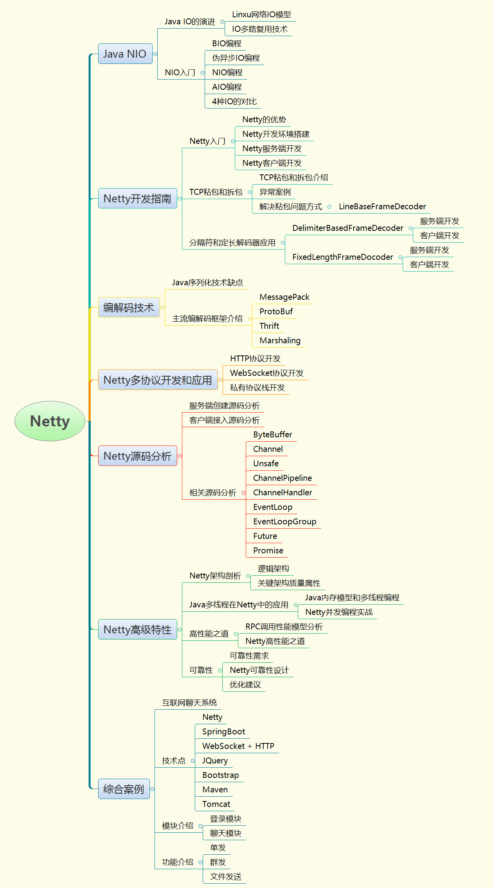

# Netty

## 一. 课程纲要

### 1. 为什么需要讲Netty

分布式系统应成为一种主流，常用的分布式服务框架例如Dubbo、RocketMQ等为了追求性能，基本都采用了Netty作为远程通信框架，为了更好的使用和理解分布式服务框架的原理，掌握Netty是至关重要的，通过Netty的学习也可以加深对异步非阻塞I/O、多线程等Java核心技术理解和掌握。

### 2. 课程目标

争取做出一版在同类培训机构中最好、最全面的Netty课程，从入门到核心功能，再到高级功能和项目实战应有尽有！

### 3. 大纲和特色

#### 特色

* 会包含Linux中常见I/O通讯模型分析
* 会包含传统BIO、NIO、AIO编程
* 分析Netty相比传统NIO编程的优势
* 介绍Netty的核心功能
* 常见编解码框架，例如MessagePack、ProtoBuf、Thrift、Marshaling
* 会介绍Netty多协议开发和应用，例如：HTTP协议、WebSocket协议和自定义协议等
* 会介绍Netty的架构特征、Netty多线程开发、高性能的秘诀和Netty可靠性的保证
* 分析Netty服务端和客户端编程源码，及Java中多线程、零拷贝技术等相关源码
* 使用Netty开发互联网聊天系统

#### 大纲

#### 时间安排

* Java NIO和Netty开发指南：1天
* 编解码技术和Netty多协议开发：1天
* Netty源码分析和高级特性：2天
* 综合案例：2天

**初步预计6天时间**

## 二. 市场竞争力

经过多方面对比，目前市场上的Netty普遍不完整，例如

* 尚硅谷的NIO课程仅仅限于Java NIO开发，并没有Netty相关课程
* 尚学堂的Netty课程太浅，仅仅限于入门级别
* 千峰教育没有NIO相关课程
* 其他网络课程均不全面

本套Netty课程目标是打造全网最全Netty教程：涵盖网络模型学习、Java NIO原生开发、Netty核心功能和高级特性、Netty源码分析及Netty项目实战。