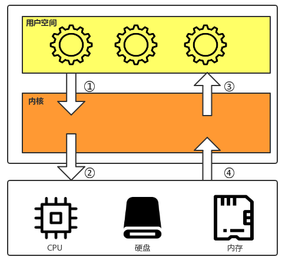

# 1. Java NIO演进

## 1.1 Java IO 演进历史

Java1.4之前的早起版本，Java对I/O的支持并不完善，开发人员在开发高性能I/O程序的时候，会面临一些巨大的挑战和差距

* 没有数据缓冲区，I/O性能存在问题
* 没有C或者C++中Channel的概念，只有输入和输出流
* 同步阻塞式通信（BIO），通常会导致线程被长时间阻塞

在Java支持异步I/O之前很长时间里，高性能服务端开发领域一直被C++和C长期占据，Java的同步阻塞I/O被大家所诟病

Java1.4开始支持异步非阻塞编程，包括：

- 进行异步I/O操作的缓冲区ByteBuffer等；
- 进行异步I/O操作的管道Pipe；
- 进行各种I/O操作的Channel，包括ServerSocketChannel和SocketChannel；
- 多种字符的编码和解码；
- 多路复用器selector;
- 基于Perl实现的正则表达式类库；
- 文件通道FileChannel

## 1.2 Java中I/O模型

### 1.2.1 阻塞与非阻塞

针对的是调用者，调用者等待被调用者返回调用结果时的状态

* 阻塞：调用结果返回之前，调用者会被挂起（不可中断睡眠态），调用者只有在得到返回结果之后才能继续；
* 非阻塞：调用者在结果返回之前，不会被挂起；即调用不会阻塞调用者，调用者可以继续处理其他的工作；

### 1.2.2 同步与异步

针对的是被调用者，关注的是被调用者结果通知机制、状态。

* 同步：调用发出之后不会立即返回，但一旦返回则是最终结果；
* 异步：调用发出之后，被调用方立即返回消息，但返回的并非最终结果；被调用者通过状态、通知机制等来通知调用者，调用者会通过回调函数处理；

### 1.2.3 三种IO模型

在Java语言中，一共提供了三种IO模型，分别是阻塞IO（BIO）、非阻塞IO（NIO）、异步IO（AIO）。

这里面的BIO和NIO都是同步的IO模型，即同步阻塞IO和同步非阻塞IO，异步IO指的是异步非阻塞IO。

* BIO （Blocking I/O）：同步阻塞I/O模式，数据的读取写入必须阻塞在一个线程内等待其完成。

* NIO （New I/O）：同时支持阻塞与非阻塞模式，但主要是使用同步非阻塞IO。

* AIO （Asynchronous I/O）：异步非阻塞I/O模型。

需要注意的是，Java中的IO模型还是借助操作系统的IO模型的，只不过是对操作系统IO模型的封装而已

## 1.3 Linux五种网络模型

### 1.3.1 用户态和内核态

- 内核态（Kernel Space）：控制计算机的硬件资源，并提供上层应用程序运行的环境。
- 用户态（User Space）：上层应用程序的活动空间，应用程序的执行必须依托于内核提供的资源。
- 系统调用（System Call）：为了使上层应用能够访问到这些资源，内核为上层应用提供访问的接口。


简单的说就是，内核空间（Kernel）是系统内核运行的空间，用户空间（User Space）是用户程序运行的空间。为了保证安全性，它们之间是隔离的。


系统调用是用户空间访问内核空间的唯一方式，保证了所有的资源访问都是在内核的控制下进行的，避免了用户程序对系统资源的越权访问，提升了系统安全性和稳定性。

### 1.3.2 文件描述符

文件描述符（File descriptor）是计算机科学中的一个术语，是一个用于表述指向文件的引用的抽象化概念。

文件描述符在形式上是一个非负整数。实际上，它是一个索引值，指向内核为每一个进程所维护的该进程打开文件的记录表。当程序打开一个现有文件或者创建一个新文件时，内核向进程返回一个文件描述符。在程序设计中，一些涉及底层的程序编写往往会围绕着文件描述符展开。但是文件描述符这一概念往往只适用于UNIX、Linux这样的操作系统。

### 1.3.3 缓存I/O

缓存 I/O 又被称作标准 I/O，大多数文件系统的默认 I/O 操作都是缓存 I/O。在 Linux 的缓存 I/O 机制中，操作系统会将 I/O 的数据缓存在文件系统的页缓存（ page cache ）中，也就是说，数据会先被拷贝到操作系统内核的缓冲区中，然后才会从操作系统内核的缓冲区拷贝到应用程序的地址空间。

**缓存 I/O 的缺点：**
数据在传输过程中需要在应用程序地址空间和内核进行多次数据拷贝操作，这些数据拷贝操作所带来的 CPU 以及内存开销是非常大的。

### 1.3.4 五种网络模型

根据UNIX网络编程对I/O的分类，UNIX提供了5种I/O模型

- **阻塞式I/O：**blocking I/O
- **非阻塞式I/O：**non-blocking I/O
- **I/O复用：** I/O multiplexing
- **信号驱动式I/O：**signal driven I/O
- **异步I/O：**asynchronous I/O

用户发起IO调用：从磁盘上的一次read操作，用户空间进程无法直接访问硬件，进程无法直接访问内核缓冲区。



1. 用户空间的进程向linux内核发起IO调用（读取文件）请求；
2. 内核从磁盘中读取数据；（等待数据完成阶段。）
3. 内核将数据加载至内核缓冲区；（等待数据完成阶段。）
4. 内核在将内核缓冲区中的数据复制到用户空间中的进程内存中（真正执行IO过程的阶段）

#### 1）阻塞I/O模型

> 阻塞式I/O模型是最常用的一个模型，也是最简单的模型。在linux中，所有的套接字默认情况下都是阻塞的。
> 进程在向内核调用执行recvfrom操作时阻塞，只有当内核将磁盘中的数据复制到内核缓冲区（内核内存空间），并实时复制到进程的缓存区完毕后返回；或者发生错误时（系统调用信号被中断）返回。在加载数据到数据复制完成，整个进程都是被阻塞的，不能处理的别的I/O，此时的进程不再消费CPU时间，而是等待响应的状态，从处理的角度来看，这是非常有效的。


**第一阶段（阻塞）：**

- ①：进程向内核发起系统调用（recvfrom）；当进程发起调用后，进程开始挂起（进程进入不可中断睡眠状态），进程一直处于等待内核处理结果的状态，此时的进程不能处理其他I/O，亦被阻塞。
- ②：内核收到进程的系统调用请求后，此时的数据包并未准备好，此时内核亦不会给进程发送任何消息，直到磁盘中的数据加载至内核缓冲区；

**第二阶段（阻塞）：**

- ③：内核再将内核缓冲区中的数据复制到用户空间中的进程缓冲区中（真正执行IO过程的阶段），直到数据复制完成。
- ④：内核返回成功数据处理完成的指令给进程；进程在收到指令后再对数据包进程处理；处理完成后，此时的进程解除不可中断睡眠态，执行下一个I/O操作。

**特点：**I/O执行的两个阶段进程都是阻塞的。

**优点：**

 1）能够及时的返回数据，无延迟；

 2）程序简单，进程挂起基本不会消耗CPU时间；

**缺点：**

 1）I/O等待对性能影响较大；

 2）每个连接需要独立的一个进程/线程处理，当并发请求量较大时为了维护程序，内存、线程和CPU上下文切换开销较大，因此较少在开发环境中使用。

#### 2）非阻塞I/O模型

> 进程在向内核调用函数recvfrom执行I/O操作时，socket是以非阻塞的形式打开的。也就是说，进程进行系统调用后，内核没有准备好数据的情况下，会立即返回一个错误码，说明进程的系统调用请求不会立即满足（WAGAIN或EWOULDBLOCK）。
> 该模型在进程发起recvfrom系统调用时，进程并没有被阻塞，内核马上返回了一个error。进程在收到error，可以处理其他的事物，过一段时间再次发起recvfrom系统调用；其不断的重复发起recvfrom系统调用，这个过程即为进程轮询（polling）。轮询的方式向内核请求数据，直到数据准备好，再复制到用户空间缓冲区，进行数据处理。需要注意的是，复制过程中进程还是阻塞的。
> 一般情况下，进程采用轮询（polling）的机制检测I/O调用的操作结果是否已完成，会消耗大量的CPU时钟周期，性能上并不一定比阻塞式I/O高；


**第一阶段（非阻塞）：**

- ①：进程向内核发起IO调用请求，内核接收到进程的I/O调用后准备处理并返回“error”的信息给进程；此后每隔一段时间进程都会向内核发起询问是否已处理完，即轮询，此过程称为忙等待；
- ②：内核收到进程的系统调用请求后，此时的数据包并未准备好，此时内核会给进程发送error信息，直到磁盘中的数据加载至内核缓冲区；

**第二阶段（阻塞）：**

- ③：内核再将内核缓冲区中的数据复制到用户空间中的进程缓冲区中（真正执行IO过程的阶段，进程阻塞），直到数据复制完成。
- ④：内核返回成功数据处理完成的指令给进程；进程在收到指令后再对数据包进程处理；

**特点：**非阻塞 I/O模式需要不断的主动询问内核kernel数据是否已准备好。

**优点：**进程在等待当前任务完成时，可以同时执行其他任务；进程不会被阻塞在内核等待数据过程，每次发起的I/O请求会立即返回，具有较好的实时性；

**缺点：**不断的轮询将占用大量的CPU时间，系统资源利用率大打折扣，影响性能，整体数据的吞吐量下降；该模型不适用web服务器；

> 非阻塞式IO相对于阻塞式IO，性能并没有提升；因为轮询是很耗资源的。不断的轮询意味着内核需要腾出更多的时间来反馈当前的处理情况，很可能没办法处理第②步了。

#### 3）I/O复用模型

> I/O复用模型也称为事件驱动式I/O模型（event driven I/O）。
> 在该模型中，每一个socket，一般都会设置成non-blocking；进程通过调用内核中的select()、poll()、epoll()函数发起系统调用请求。selec/poll/epoll相当于内核中的代理，进程所有的请求都会先请求这几个函数中的某一个；此时，一个进程可以同时处理多个网络连接的I/O；select/poll/epoll这个函数会不断的轮询（polling）所负责的socket，当某个socket有数据报准备好了（意味着socket可读），就会返回可读的通知信号给进程。
> 用户进程调用select/poll/epoll后，进程实际上是被阻塞的，同时，内核会监视所有select/poll/epoll所负责的socket，当其中任意一个数据准备好了，就会通知进程。只不过进程是阻塞在select/poll/epoll之上，而不是被内核准备数据过程中阻塞。此时，进程再发起recvfrom系统调用，将数据中内核缓冲区拷贝到内核进程，这个过程是阻塞的。
> 虽然select/poll/epoll可以使得进程看起来是非阻塞的，因为进程可以处理多个连接，但是最多只有1024个网络连接的I/O；本质上进程还是阻塞的，只不过它可以处理更多的网络连接的I/O而已


**第一阶段（阻塞在select/poll之上）：**

- ①：进程向内核发起select/poll的系统调用，select将该调用通知内核开始准备数据，而内核不会返回任何通知消息给进程，但进程可以继续处理更多的网络连接I/O；
- ②：内核收到进程的系统调用请求后，此时的数据包并未准备好，此时内核亦不会给进程发送任何消息，直到磁盘中的数据加载至内核缓冲区；而后通过select()/poll()函数将socket的可读条件返回给进程

**第二阶段（阻塞）：**

- ③：进程在收到SIGIO信号程序之后，进程向内核发起系统调用（recvfrom）；
- ④：内核再将内核缓冲区中的数据复制到用户空间中的进程缓冲区中（真正执行IO过程的阶段），直到数据复制完成。
- ⑤：内核返回成功数据处理完成的指令给进程；进程在收到指令后再对数据包进程处理；处理完成后，此时的进程解除不可中断睡眠态，执行下一个I/O操作。

**特点：**通过这种机制能同时等待多个文件描述符，而这些文件描述符（套接字描述符）其中的任意一个变为可读就绪状态，select()/poll()函数就会返回。

**优点：**可以基于一个阻塞对象，同时在多个描述符上可读就绪，而不是使用多个线程（每个描述符一个线程），即能处理更多的连接；这样可以节省更多的系统资源。

**缺点：**如果处理的连接数不是很多的话，使用select/poll的web server不一定比使用多线程 + 阻塞IO模型的web server性能更好；反而可能延迟还更大；原因在于，处理一个连接数需要发起两次system call；

#### 4）信号驱动I/O模型

> 信号驱动式I/O是指进程预先告知内核，使得某个文件描述符上发生了变化时，内核使用信号通知该进程。
> 在信号驱动式I/O模型，进程使用socket进行信号驱动I/O，并建立一个SIGIO信号处理函数，当进程通过该信号处理函数向内核发起I/O调用时，内核并没有准备好数据报，而是返回一个信号给进程，此时进程可以继续发起其他I/O调用。也就是说，在第一阶段内核准备数据的过程中，进程并不会被阻塞，会继续执行。当数据报准备好之后，内核会递交SIGIO信号，通知用户空间的信号处理程序，数据已准备好；此时进程会发起recvfrom的系统调用，这一个阶段与阻塞式I/O无异。也就是说，在第二阶段内核复制数据到用户空间的过程中，进程同样是被阻塞的。


**第一阶段（非阻塞）：**

- ①：进程使用socket进行信号驱动I/O，建立SIGIO信号处理函数，向内核发起系统调用，内核在未准备好数据报的情况下返回一个信号给进程，此时进程可以继续做其他事情；
- ②：内核将磁盘中的数据加载至内核缓冲区完成后，会递交SIGIO信号给用户空间的信号处理程序；

**第二阶段（阻塞）：**

- ③：进程在收到SIGIO信号程序之后，进程向内核发起系统调用（recvfrom）；
- ④：内核再将内核缓冲区中的数据复制到用户空间中的进程缓冲区中（真正执行IO过程的阶段），直到数据复制完成。
- ⑤：内核返回成功数据处理完成的指令给进程；进程在收到指令后再对数据包进程处理；处理完成后，此时的进程解除不可中断睡眠态，执行下一个I/O操作。

**特点：**借助socket进行信号驱动I/O并建立SIGIO信号处理函数

**优点：**线程并没有在第一阶段（数据等待）时被阻塞，提高了资源利用率；

**缺点：**

 1）在程序的实现上比较困难；

 2）信号 I/O 在大量 IO 操作时可能会因为信号队列溢出导致没法通知。信号驱动 I/O 尽管对于处理 UDP 套接字来说有用，即这种信号通知意味着到达一个数据报，或者返回一个异步错误。但是，对于 TCP 而言，信号驱动的 I/O 方式近乎无用，因为导致这种通知的条件为数众多，每一个来进行判别会消耗很大资源，与前几种方式相比优势尽失。

**信号通知机制：**

> **水平触发：**指数据报到内核缓冲区准备好之后，内核通知进程后，进程因繁忙未发起recvfrom系统调用；内核会再次发送通知信号，循环往复，直到进程来请求recvfrom系统调用。很明显，这种方式会频繁消耗过多的系统资源。
>
> **边缘触发：**内核只会发送一次通知信号。

#### 5）异步I/O

> 异步I/O可以说是在信号驱动式I/O模型上改进而来。
> 在异步I/O模型中，进程会向内核请求aio_read（异步读）的系统调用操作，会把套接字描述符、缓冲区指针、缓冲区大小和文件偏移一起发给内核，当内核收到后会返回“已收到”的消息给进程，此时进程可以继续处理其他I/O任务。也就是说，在第一阶段内核准备数据的过程中，进程并不会被阻塞，会继续执行。第二阶段，当数据报准备好之后，内核会负责将数据报复制到用户进程缓冲区，这个过程也是由内核完成，进程不会被阻塞。复制完成后，内核向进程递交aio_read的指定信号，进程在收到信号后进行处理并处理数据报向外发送。
> 在进程发起I/O调用到收到结果的过程，进程都是非阻塞的。


**第一阶段（非阻塞）：**

- ①：进程向内核请求aio_read（异步读）的系统调用操作，会把套接字描述符、缓冲区指针、缓冲区大小和文件偏移一起发给内核，当内核收到后会返回“已收到”的消息给进程
- ②：内核将磁盘中的数据加载至内核缓冲区，直到数据报准备好；

**第二阶段（非阻塞）：**

- ③：内核开始复制数据，将准备好的数据报复制到进程内存空间，直到数据报复制完成
- ④：内核向进程递交aio_read的返回指令信号，通知进程数据已复制到进程内存中；

**特点：**第一阶段和第二阶段都是由内核完成

**优点：**能充分利用DMA的特性，将I/O操作与计算重叠，提高性能、资源利用率与并发能力

**缺点：**

 1）在程序的实现上比较困难；

 2）要实现真正的异步 I/O，操作系统需要做大量的工作。目前 Windows 下通过 IOCP 实现了真正的异步 I/O。而在 Linux 系统下，Linux 2.6才引入，目前 AIO 并不完善，因此在 Linux 下实现高并发网络编程时都是以 复用式I/O模型为主。

### 1.3.5 select/poll/epoll对比


# 2. NIO 入门

## 2.1 BIO编程

### 2.1.1 编程模型


**步骤：**

1. 服务器监听指定端口
2. 客户端请求服务器
3. 服务器启动新线程处理
4. 线程响应客户端

### 2.1.2 编码

#### 1）服务端

```java
public class TimeServer {

    public static void main(String[] args) throws IOException {
        int port = 8080;
        if (args != null && args.length > 0) {

            try {
                port = Integer.valueOf(args[0]);
            } catch (NumberFormatException e) {
                // 采用默认值
            }

        }
        ServerSocket server = null;
        try {
            //创建ServerSocket
            server = new ServerSocket(port);
            System.out.println("The time server is start in port : " + port);
            Socket socket = null;
            //循环
            while (true) {
                socket = server.accept();
                System.out.println("听说程序阻塞在这里。。。。。。。。");
                new Thread(new TimeServerHandler(socket)).start();
            }
        } finally {
            if (server != null) {
                System.out.println("The time server close");
                server.close();
                server = null;
            }
        }
    }
}
```

**TimeServerHandler**

```java
public class TimeServerHandler implements Runnable {

    private Socket socket;

    public TimeServerHandler(Socket socket) {
        this.socket = socket;
    }

    @Override
    public void run() {
        BufferedReader in = null;
        PrintWriter out = null;
        try {
            in = new BufferedReader(new InputStreamReader(
                    this.socket.getInputStream()));
            out = new PrintWriter(this.socket.getOutputStream(), true);
            String currentTime = null;
            String body = null;
            while (true) {
                body = in.readLine();
                if (body == null)
                    break;
                System.out.println("The time server receive order : " + body);
                currentTime = "QUERY TIME ORDER".equalsIgnoreCase(body) ? new java.util.Date(
                        System.currentTimeMillis()).toString() : "BAD ORDER";
                out.println(currentTime);
            }

        } catch (Exception e) {
            if (in != null) {
                try {
                    in.close();
                } catch (IOException e1) {
                    e1.printStackTrace();
                }
            }
            if (out != null) {
                out.close();
                out = null;
            }
            if (this.socket != null) {
                try {
                    this.socket.close();
                } catch (IOException e1) {
                    e1.printStackTrace();
                }
                this.socket = null;
            }
        }
    }
}
```

#### 2）客户端

```java
public class TimeClient {

    public static void main(String[] args) {

        int port = 8080;
        if (args != null && args.length > 0) {

            try {
                port = Integer.valueOf(args[0]);
            } catch (NumberFormatException e) {
                // 采用默认值
            }

        }
        Socket socket = null;
        BufferedReader in = null;
        PrintWriter out = null;
        try {
            socket = new Socket("127.0.0.1", port);
            in = new BufferedReader(new InputStreamReader(
                    socket.getInputStream()));
            out = new PrintWriter(socket.getOutputStream(), true);
            out.println("QUERY TIME ORDER");
            System.out.println("Send order 2 server succeed.");
            String resp = in.readLine();
            System.out.println("Now is : " + resp);
        } catch (Exception e) {
            e.printStackTrace();
        } finally {
            if (out != null) {
                out.close();
                out = null;
            }

            if (in != null) {
                try {
                    in.close();
                } catch (IOException e) {
                    e.printStackTrace();
                }
                in = null;
            }

            if (socket != null) {
                try {
                    socket.close();
                } catch (IOException e) {
                    e.printStackTrace();
                }
              
                socket = null;
            }
        }
    }
}
```

### 2.1.3 总结

该模型最大的问题是就是缺乏弹性伸缩能力，当客户端并发访问量增加后，服务端的线程个数和客户端并发访问数呈1:1，由于线程是Java虚拟机非常宝贵的系统资源，当线程数膨胀后，系统的性能急剧下降，随着并发访问量继续增大，系统会出现线程堆栈溢出、创建新线程失败等问题，并最终导致进程宕机或者僵死，不能对外提供服务。

## 2.2 伪异步IO

对BIO编程模型就行优化，后端通过一个线程池处理多个请求连接，形成一个客户端个数M：线程池最大线程数N的比例关系，其中M可以远远大于N。通过线程池可以灵活地调配线程资源，设置线程的最大值，防止由于海量并发接入导致线程耗尽。

### 2.2.1 编程模型


**步骤：**

1. 服务器监听指定端口
2. 客户端请求服务器
3. 服务器将客户端的Socket链接封装成一个Task任务，然后投递到线程池中进行处理
4. 后端线程池维护一个消息队列和N个活跃线程，对消息队列中的任务进行处理

### 2.1.3 编码

####1）服务端

```java
public class TimeServer {

    public static void main(String[] args) throws IOException {
        int port = 8080;
        if (args != null && args.length > 0) {

            try {
                port = Integer.valueOf(args[0]);
            } catch (NumberFormatException e) {
                // 采用默认值
            }

        }
        ServerSocket server = null;
        try {
            server = new ServerSocket(port);
            System.out.println("The time server is start in port : " + port);
            Socket socket = null;
            TimeServerHandlerExecutePool singleExecutor = new TimeServerHandlerExecutePool(
                    50, 10000);// 创建IO任务线程池
            while (true) {
                socket = server.accept();
                singleExecutor.execute(new TimeServerHandler(socket));
            }
        } finally {
            if (server != null) {
                System.out.println("The time server close");
                server.close();
                server = null;
            }
        }
    }
}
```

**TimeServerHandlerExecutePool线程池**

```java
public class TimeServerHandlerExecutePool {

    private ExecutorService executor;

    public TimeServerHandlerExecutePool(int maxPoolSize, int queueSize) {
        executor = new ThreadPoolExecutor(Runtime.getRuntime()
                .availableProcessors(), maxPoolSize, 120L, TimeUnit.SECONDS,
                new ArrayBlockingQueue<Runnable>(queueSize));
    }

    public void execute(Runnable task) {
        executor.execute(task);
    }
}
```

#### 2）客户端

代码同BIO客户端代码

### 2.2.3 总结

伪异步I/O通信框架采用了线程池实现，因此避免了每个请求都创建一个新的线程造成线程资源耗尽的问题。因为它的底层通信依然采用同步阻塞的方式，因此无法从根本上解决性能的问题。

## 2.3 NIO编程

NIO到底是什么？有人称之为New I/O，原因是它相对于以前的I/O类库是新增的。由于之前老的I/O类库是阻塞的，而新的I/O类库是非阻塞的，所以大家更喜欢称之为非阻塞I/O（Not-Blocking I/O）。

与Socket和ServerSocket类相对应，NIO也提供了SocketChannel与ServerSocketChannel类两种不同的套接字的实现。这两种通道都支持阻塞和非阻塞两种模式。低负载、低并发的应用程序可以使用阻塞模式，高负载、高并发的网络应用可以使用非阻塞模式。

### 2.3.1 NIO类库简介

#### 1）缓冲区Buffer

Buffer是一个对象，包含要写入或者要读出的数据。在面向Stream流中，可以将数据直接写入或者读出到Stream对象中。而在NIO中，所有数据都是用缓冲区处理的。在读数据时，将数据读入到缓冲区，在写出数据时，也是将数据写到缓冲区。任何时候访问NIO的数据，都是通过缓冲区进行操作。

缓冲区实质上是一个数组。通常它是一个字节数组（ByteBuffer），也可以是其他类型的数组。但是缓冲区不仅仅是一个数组，还提供了数据的结构化访问和维护了数据读写位置（limit）的信息。


每个类都是Buffer的子实例。除了ByteBuffer以外，每一个Buffer类都有相同的操作，只是他们所处理的数据类型不一样。

因为大多数标准的I/O操作都用ByteBuffer，所以它在一般缓冲区的操作之外还具备一些特有的操作，以方便网络读写。

####2）通道Channel

Channel是一个通道，它想自来水管一样，网络数据通过Channel进行读取和写入。Channel通道与Stream流不同之处在于它是双向的，流只是在一个方向上移动（一个流必须是InputStream或者OutputStream的子类），而通道可以进行读、写或两者同时进行。因为Channel是全双工的，所以它比流更好的映射底层操作系统的API。因为底层操作系统的通信操作都是全双工的，同时支持都写操作。


Channle可以分为两大类：用于网络读写的SelectableChannle和用于文件操作的FileChannel。SocketChannel和ServerSocketChannel都是SelectableChannel的子类。

####3）多路复用器Selector

多路复用器Selector是JavaNIO的编程基础。多路复用器提供选择已经就绪任务的能力。简单来讲，Selector会不断轮询注册在其上的Channel，如果某个Channel上面发生读或者写操作事件，这个Channel就处于就绪状态，会被Selector轮询出来，然后通过SelectionKey可以获取就绪的Channel的集合，进行后续的I/O操作。

一个多路复用器可以同时轮询多个Channel，由于JDK提供了epoll()代替传统的select实现，所以它并没有连接最大句柄的限制。这也就意味着一个线程负责Selector的轮询，就可以接入成千上万的客户端连接。

###2.3.2 编码

<u>**时序图**</u>


#### 1）服务端

```java
public class TimeServer {

    public static void main(String[] args) throws IOException {
        int port = 8080;
        if (args != null && args.length > 0) {
            try {
                port = Integer.valueOf(args[0]);
            } catch (NumberFormatException e) {
                // 采用默认值
            }
        }
        MultiplexerTimeServer timeServer = new MultiplexerTimeServer(port);
        new Thread(timeServer, "NIO-MultiplexerTimeServer-001").start();
    }
}
```

**MultiplexerTimeServer**

```java
public class MultiplexerTimeServer implements Runnable {

    private Selector selector;

    private ServerSocketChannel servChannel;

    private volatile boolean stop;

    /**
     * 初始化多路复用器、绑定监听端口
     *
     * @param port
     */
    public MultiplexerTimeServer(int port) {
        try {
            selector = Selector.open();
            servChannel = ServerSocketChannel.open();
            servChannel.configureBlocking(false);
            servChannel.socket().bind(new InetSocketAddress(port), 1024);
            servChannel.register(selector, SelectionKey.OP_ACCEPT);
            System.out.println("The time server is start in port : " + port);
        } catch (IOException e) {
            e.printStackTrace();
            System.exit(1);
        }
    }

    public void stop() {
        this.stop = true;
    }

    /*
     * (non-Javadoc)
     * 
     * @see java.lang.Runnable#run()
     */
    @Override
    public void run() {
        while (!stop) {
            try {
                selector.select(1000);
                Set<SelectionKey> selectedKeys = selector.selectedKeys();
                Iterator<SelectionKey> it = selectedKeys.iterator();
                SelectionKey key = null;
                while (it.hasNext()) {
                    key = it.next();
                    it.remove();
                    try {
                        handleInput(key);
                    } catch (Exception e) {
                        if (key != null) {
                            key.cancel();
                            if (key.channel() != null)
                                key.channel().close();
                        }
                    }
                }
            } catch (Throwable t) {
                t.printStackTrace();
            }
        }

        // 多路复用器关闭后，所有注册在上面的Channel和Pipe等资源都会被自动去注册并关闭，所以不需要重复释放资源
        if (selector != null)
            try {
                selector.close();
            } catch (IOException e) {
                e.printStackTrace();
            }
    }

    private void handleInput(SelectionKey key) throws IOException {

        if (key.isValid()) {
            // 处理新接入的请求消息
            if (key.isAcceptable()) {
                // Accept the new connection
                ServerSocketChannel ssc = (ServerSocketChannel) key.channel();
                SocketChannel sc = ssc.accept();
                sc.configureBlocking(false);
                // Add the new connection to the selector
                sc.register(selector, SelectionKey.OP_READ);
            }
            if (key.isReadable()) {
                // Read the data
                SocketChannel sc = (SocketChannel) key.channel();
                ByteBuffer readBuffer = ByteBuffer.allocate(1024);
                int readBytes = sc.read(readBuffer);
                if (readBytes > 0) {
                    readBuffer.flip();
                    byte[] bytes = new byte[readBuffer.remaining()];
                    readBuffer.get(bytes);
                    String body = new String(bytes, "UTF-8");
                    System.out.println("The time server receive order : "+ body);
                    String currentTime = "QUERY TIME ORDER"
                        .equalsIgnoreCase(body) ? new java.util.Date(
                            System.currentTimeMillis()).toString()
                            : "BAD ORDER";
                    doWrite(sc, currentTime);
                } else if (readBytes < 0) {
                    // 对端链路关闭
                    key.cancel();
                    sc.close();
                } else
                    ; // 读到0字节，忽略
            }
        }
    }

    private void doWrite(SocketChannel channel, String response)
            throws IOException {
        if (response != null && response.trim().length() > 0) {
            byte[] bytes = response.getBytes();
            ByteBuffer writeBuffer = ByteBuffer.allocate(bytes.length);
            writeBuffer.put(bytes);
            writeBuffer.flip();
            channel.write(writeBuffer);
        }
    }
}
```

#### 2）客户端

<u>**时序图**</u>


**TimeClient**

```java
public class TimeClient {

    /**
     * @param args
     */
    public static void main(String[] args) {

        int port = 8080;
        if (args != null && args.length > 0) {
            try {
                port = Integer.valueOf(args[0]);
            } catch (NumberFormatException e) {
                // 采用默认值
            }
        }
        new Thread(new TimeClientHandle("127.0.0.1", port), "TimeClient-001")
                .start();
    }
}
```

**TimeClientHandle**

```java
public class TimeClientHandle implements Runnable {

    private String host;
    private int port;

    private Selector selector;
    private SocketChannel socketChannel;

    private volatile boolean stop;

    public TimeClientHandle(String host, int port) {
        this.host = host == null ? "127.0.0.1" : host;
        this.port = port;
        try {
            selector = Selector.open();
            socketChannel = SocketChannel.open();
            socketChannel.configureBlocking(false);
        } catch (IOException e) {
            e.printStackTrace();
            System.exit(1);
        }
    }

    /*
     * (non-Javadoc)
     * 
     * @see java.lang.Runnable#run()
     */
    @Override
    public void run() {
        try {
            doConnect();
        } catch (IOException e) {
            e.printStackTrace();
            System.exit(1);
        }
        while (!stop) {
            try {
                selector.select(1000);
                Set<SelectionKey> selectedKeys = selector.selectedKeys();
                Iterator<SelectionKey> it = selectedKeys.iterator();
                SelectionKey key = null;
                while (it.hasNext()) {
                    key = it.next();
                    it.remove();
                    try {
                        handleInput(key);
                    } catch (Exception e) {
                        if (key != null) {
                            key.cancel();
                            if (key.channel() != null)
                                key.channel().close();
                        }
                    }
                }
            } catch (Exception e) {
                e.printStackTrace();
                System.exit(1);
            }
        }

        // 多路复用器关闭后，所有注册在上面的Channel和Pipe等资源都会被自动去注册并关闭，所以不需要重复释放资源
        if (selector != null)
            try {
                selector.close();
            } catch (IOException e) {
                e.printStackTrace();
            }

    }

    private void handleInput(SelectionKey key) throws IOException {

        if (key.isValid()) {
            // 判断是否连接成功
            SocketChannel sc = (SocketChannel) key.channel();
            if (key.isConnectable()) {
                if (sc.finishConnect()) {
                    sc.register(selector, SelectionKey.OP_READ);
                    doWrite(sc);
                } else
                    System.exit(1);// 连接失败，进程退出
            }
            if (key.isReadable()) {
                ByteBuffer readBuffer = ByteBuffer.allocate(1024);
                int readBytes = sc.read(readBuffer);
                if (readBytes > 0) {
                    readBuffer.flip();
                    byte[] bytes = new byte[readBuffer.remaining()];
                    readBuffer.get(bytes);
                    String body = new String(bytes, "UTF-8");
                    System.out.println("Now is : " + body);
                    this.stop = true;
                } else if (readBytes < 0) {
                    // 对端链路关闭
                    key.cancel();
                    sc.close();
                } else
                    ; // 读到0字节，忽略
            }
        }

    }

    private void doConnect() throws IOException {
        // 如果直接连接成功，则注册到多路复用器上，发送请求消息，读应答
        if (socketChannel.connect(new InetSocketAddress(host, port))) {
            socketChannel.register(selector, SelectionKey.OP_READ);
            doWrite(socketChannel);
        } else
            socketChannel.register(selector, SelectionKey.OP_CONNECT);
    }

    private void doWrite(SocketChannel sc) throws IOException {
        byte[] req = "QUERY TIME ORDER".getBytes();
        ByteBuffer writeBuffer = ByteBuffer.allocate(req.length);
        writeBuffer.put(req);
        writeBuffer.flip();
        sc.write(writeBuffer);
            if (!writeBuffer.hasRemaining())
            System.out.println("Send order 2 server succeed.");
    }

}
```

## 2.4 AIO编程

NIO2.0的异步套接字是真正的异步非阻塞I/O，对应于UNIX网络编程中的事件驱动I/O（AIO）。它不需要通过多路复用器（Selector）对注册的通道进行轮询操作即可实现异步读写，从而简化了NIO的编程模型。

### 1）服务端

**TimeServer**

```java
public class TimeServer {
    public static void main(String[] args) throws IOException {
	int port = 8080;
	if (args != null && args.length > 0) {
	    try {
		port = Integer.valueOf(args[0]);
	    } catch (NumberFormatException e) {
		// 采用默认值
	    }
	}
	AsyncTimeServerHandler timeServer = new AsyncTimeServerHandler(port);
	new Thread(timeServer, "AIO-AsyncTimeServerHandler-001").start();
    }
}
```

**AsyncTimeServerHandler**

```java
public class AsyncTimeServerHandler implements Runnable {

    private int port;

    CountDownLatch latch;
    AsynchronousServerSocketChannel asynchronousServerSocketChannel;

    public AsyncTimeServerHandler(int port) {
        this.port = port;
        try {
            asynchronousServerSocketChannel = AsynchronousServerSocketChannel.open();
            asynchronousServerSocketChannel.bind(new InetSocketAddress(port));
            System.out.println("The time server is start in port : " + port);
        } catch (IOException e) {
            e.printStackTrace();
        }
    }


    @Override
    public void run() {
        latch = new CountDownLatch(1);
        doAccept();
        try {
            latch.await();
        } catch (InterruptedException e) {
            e.printStackTrace();
        }
    }

    public void doAccept() {
        asynchronousServerSocketChannel.accept(this,new AcceptCompletionHandler());
    }

}
```

**AcceptCompletionHandler**

```java
public class AcceptCompletionHandler implements
        CompletionHandler<AsynchronousSocketChannel, AsyncTimeServerHandler> {

    @Override
    public void completed(AsynchronousSocketChannel result,AsyncTimeServerHandler attachment) {
        attachment.asynchronousServerSocketChannel.accept(attachment, this);
        ByteBuffer buffer = ByteBuffer.allocate(1024);
        result.read(buffer, buffer, new ReadCompletionHandler(result));
    }

    @Override
    public void failed(Throwable exc, AsyncTimeServerHandler attachment) {
        exc.printStackTrace();
        attachment.latch.countDown();
    }

}
```

**ReadCompletionHandler**

```java
public class ReadCompletionHandler implements
        CompletionHandler<Integer, ByteBuffer> {

    private AsynchronousSocketChannel channel;

    public ReadCompletionHandler(AsynchronousSocketChannel channel) {
        if (this.channel == null)
            this.channel = channel;
    }

    @Override
    public void completed(Integer result, ByteBuffer attachment) {
        attachment.flip();
        byte[] body = new byte[attachment.remaining()];
        attachment.get(body);
        try {
            String req = new String(body, "UTF-8");
            System.out.println("The time server receive order : " + req);
            String currentTime = "QUERY TIME ORDER".equalsIgnoreCase(req) ? new java.util.Date(
                    System.currentTimeMillis()).toString() : "BAD ORDER";
            doWrite(currentTime);
        } catch (UnsupportedEncodingException e) {
            e.printStackTrace();
        }
    }

    private void doWrite(String currentTime) {
        if (currentTime != null && currentTime.trim().length() > 0) {
            byte[] bytes = (currentTime).getBytes();
            ByteBuffer writeBuffer = ByteBuffer.allocate(bytes.length);
            writeBuffer.put(bytes);
            writeBuffer.flip();
            channel.write(writeBuffer, writeBuffer,
                    new CompletionHandler<Integer, ByteBuffer>() {
                        @Override
                        public void completed(Integer result, ByteBuffer buffer) {
                            // 如果没有发送完成，继续发送
                            if (buffer.hasRemaining())
                                channel.write(buffer, buffer, this);
                        }

                        @Override
                        public void failed(Throwable exc, ByteBuffer attachment) {
                            try {
                                channel.close();
                            } catch (IOException e) {
                                // ingnore on close
                            }
                        }
                    });
        }
    }

    @Override
    public void failed(Throwable exc, ByteBuffer attachment) {
        try {
            this.channel.close();
        } catch (IOException e) {
            e.printStackTrace();
        }
    }

}
```

###2）客户端

**TimeClient**

```java
public class TimeClient {

    public static void main(String[] args) {
        int port = 8080;
        if (args != null && args.length > 0) {
            try {
                port = Integer.valueOf(args[0]);
            } catch (NumberFormatException e) {
                // 采用默认值
            }

        }
        new Thread(new AsyncTimeClientHandler("127.0.0.1", port),
                "AIO-AsyncTimeClientHandler-001").start();

    }
}
```

**AsyncTimeClientHandler**

```java
public class AsyncTimeClientHandler implements
        CompletionHandler<Void, AsyncTimeClientHandler>, Runnable {

    private AsynchronousSocketChannel client;
    private String host;
    private int port;
    private CountDownLatch latch;

    public AsyncTimeClientHandler(String host, int port) {
        this.host = host;
        this.port = port;
        try {
            client = AsynchronousSocketChannel.open();
        } catch (IOException e) {
            e.printStackTrace();
        }
    }

    @Override
    public void run() {

        latch = new CountDownLatch(1);
        client.connect(new InetSocketAddress(host, port), this, this);
        try {
            latch.await();
        } catch (InterruptedException e1) {
            e1.printStackTrace();
        }
        try {
            client.close();
        } catch (IOException e) {
            e.printStackTrace();
        }
    }

    @Override
    public void completed(Void result, AsyncTimeClientHandler attachment) {
        byte[] req = "QUERY TIME ORDER".getBytes();
        ByteBuffer writeBuffer = ByteBuffer.allocate(req.length);
        writeBuffer.put(req);
        writeBuffer.flip();
        client.write(writeBuffer, writeBuffer,
                new CompletionHandler<Integer, ByteBuffer>() {
                    @Override
                    public void completed(Integer result, ByteBuffer buffer) {
                        if (buffer.hasRemaining()) {
                            client.write(buffer, buffer, this);
                        } else {
                            ByteBuffer readBuffer = ByteBuffer.allocate(1024);
                            client.read(
                                    readBuffer,
                                    readBuffer,
                                    new CompletionHandler<Integer, ByteBuffer>() {
                                        @Override
                                        public void completed(Integer result,
                                                              ByteBuffer buffer) {
                                            buffer.flip();
                                            byte[] bytes = new byte[buffer
                                                    .remaining()];
                                            buffer.get(bytes);
                                            String body;
                                            try {
                                                body = new String(bytes,
                                                        "UTF-8");
                                                System.out.println("Now is : "
                                                        + body);
                                                latch.countDown();
                                            } catch (UnsupportedEncodingException e) {
                                                e.printStackTrace();
                                            }
                                        }

                                        @Override
                                        public void failed(Throwable exc,
                                                           ByteBuffer attachment) {
                                            try {
                                                client.close();
                                                latch.countDown();
                                            } catch (IOException e) {
                                                // ingnore on close
                                            }
                                        }
                                    });
                        }
                    }

                    @Override
                    public void failed(Throwable exc, ByteBuffer attachment) {
                        try {
                            client.close();
                            latch.countDown();
                        } catch (IOException e) {
                            // ingnore on close
                        }
                    }
                });
    }

    @Override
    public void failed(Throwable exc, AsyncTimeClientHandler attachment) {
        exc.printStackTrace();
        try {
            client.close();
            latch.countDown();
        } catch (IOException e) {
            e.printStackTrace();
        }
    }

}
```


